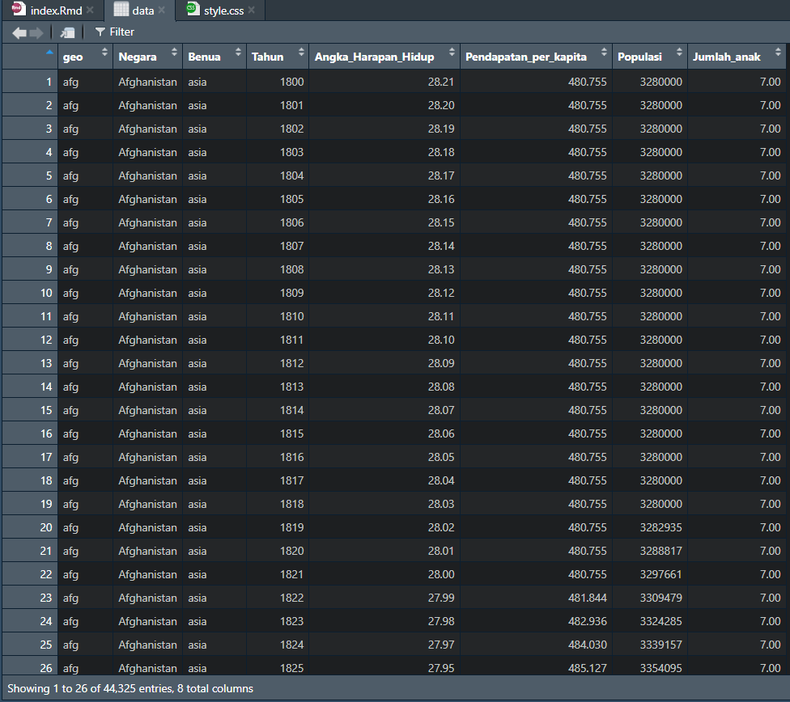

```{=html}
<style>
body{
text-align: justify}
</style>
```
```{r setup, include=FALSE}
knitr::opts_chunk$set(echo = TRUE)
```

# Pendahuluan

Analisis data merupakan langkah penting dalam memahami berbagai tren sosial, ekonomi, dan demografi suatu negara. Dataset yang digunakan dalam penelitian ini berisi informasi tentang berbagai negara dari tahun ke tahun, mencakup variabel seperti angka harapan hidup, pendapatan per kapita, populasi, dan rata-rata jumlah anak.

Dengan menggunakan bahasa pemrograman R dan library ggplot2, analisis ini bertujuan untuk mengeksplorasi hubungan antara variabel-variabel tersebut. Melalui visualisasi data, kita dapat memahami bagaimana angka harapan hidup dan pendapatan per kapita berkembang seiring waktu di berbagai wilayah dunia. Selain itu, analisis ini juga dapat membantu dalam mengidentifikasi pola dan perbedaan antar negara dan benua.

Penelitian ini tidak hanya berfokus pada eksplorasi data, tetapi juga pada pemanfaatan teknik statistik untuk mendapatkan wawasan yang lebih mendalam. Dengan demikian, hasil dari analisis ini diharapkan dapat memberikan gambaran yang jelas mengenai tren global dalam berbagai aspek sosial-ekonomi.n ggplot2 sebagai pilihan utama untuk analisis data di R.


## Dasar-Dasar  
Langkah awal kita harus memasukan data csv ke R. 
untuk memudahkan, drag and drop di folder yang akan di gunakan


Kemudian di baca datanya 
```{r cars}
data <- read.csv("data.csv")
```


# Univat
Univariat adalah teknik eksplorasi data yang hanya melibatkan satu variabel untuk memahami distribusinya, kecenderungan sentral, dan penyebarannya. Pada histogram di bawah, visualisasi dilakukan dipangil menggunaan library(ggplot2) dengan menampilkan distribusi angka harapan hidup. Warna diatur agar lebih estetis, serta ditambahkan garis kepadatan (density) untuk memperjelas pola distribusi. Dengan menggunakan binwidth = 5, histogram menunjukkan bagaimana nilai angka harapan hidup tersebar dalam dataset, membantu dalam analisis tren dan identifikasi outlier.


## Histogram

Variabel yang digunakan angka harapan hidup

```{r}
library(ggplot2)

ggplot(data, aes(x = Angka_Harapan_Hidup)) +
  geom_histogram(binwidth = 5, fill = "#E5989B", color = "#B5828C") +
  labs(title = "Grafik Angka Harapan Hidup", x = "Angka Harapan Hidup", y = "Frekuensi") +
  theme_minimal()

```


## Density Plot

Density plot mirip dengan histogram, tetapi lebih halus karena menggunakan kurva untuk menunjukkan distribusi data. Variable  yang di

```{r}
library(ggplot2)
ggplot(data, aes(x = Jumlah_anak)) +
  geom_density(fill = "#E5989B", alpha = 0.5) +
  labs(title = "Kepadatan Jumlah Anak",
       x = "Jumlah Anak",
       y = "Kepadatan") +
  theme_minimal()

```

# Bivariat
Analisis bivariat adalah metode statistik yang digunakan untuk melihat hubungan antara dua variabel.

## histogram 
Dua variabel adalah Benua (kategori) dan Populasi (numerik). Data dihitung menggunakan aggregate() untuk menjumlahkan total populasi di setiap benua, lalu divisualisasikan menggunakan ggplot2 dalam bentuk grafik batang. Grafik ini membantu memahami bagaimana distribusi populasi berbeda di setiap benua. Analisis bivariat seperti ini sering digunakan untuk mengidentifikasi pola, perbandingan, atau hubungan antara dua variabel sebelum melakukan analisis lebih lanjut seperti korelasi atau regresi.

```{r}
library(ggplot2)

# Menghitung total populasi per benua
total_population <- aggregate(Populasi ~ Benua, data = data, sum)

ggplot(total_population, aes(y = Benua, x = Populasi, fill = Benua)) +
  geom_bar(stat = "identity") +
  labs(title = "Total Populasi Berdasarkan Benua",
       x = "Total Populasi",
       y = "Benua") +
  theme_minimal() +
  scale_fill_brewer(palette = "Pastel1")
```

## scatter plot
Scatter plot ini menunjukkan hubungan antara pendapatan per kapita dan angka harapan hidup di berbagai negara, dengan warna yang membedakan setiap benua. Penggunaan skala logaritmik pada sumbu X membantu menampilkan distribusi data yang lebih jelas, terutama karena pendapatan per kapita cenderung bervariasi secara ekstrem. Jika titik-titik membentuk pola naik, ini menunjukkan bahwa negara dengan pendapatan per kapita lebih tinggi cenderung memiliki angka harapan hidup yang lebih panjang, mencerminkan hubungan positif antara kesejahteraan ekonomi dan kesehatan.
```{r}
library(ggplot2)

ggplot(data, aes(x = Pendapatan_per_kapita, y = Angka_Harapan_Hidup, color = Benua)) +
  geom_point(alpha = 0.7, size = 3) +
  labs(title = "Grafik Pendapatan per Kapita dan Angka Harapan Hidup",
       x = "Pendapatan per Kapita",
       y = "Angka Harapan Hidup",
       color = "Benua") +
  theme_minimal() +
  scale_x_log10() 

```


# Multivariat
Analisis multivariat adalah teknik eksplorasi data yang melibatkan lebih dari dua variabel untuk memahami hubungan kompleks di antara mereka. Dalam scatter plot 3D ini, hubungan antara pendapatan per kapita, angka harapan hidup, dan populasi divisualisasikan menggunakan plotly, dengan warna yang membedakan setiap benua. Sumbu X merepresentasikan pendapatan per kapita, sumbu Y menunjukkan angka harapan hidup, dan sumbu Z menggambarkan populasi suatu negara. Visualisasi ini memungkinkan analisis interaktif, di mana pengguna dapat memutar dan memperbesar grafik untuk melihat pola hubungan lebih jelas. Dengan pendekatan ini, dapat diamati bagaimana kesejahteraan ekonomi, kesehatan, dan jumlah populasi suatu negara saling berkaitan dalam berbagai wilayah di dunia.

```{r}
suppressPackageStartupMessages(library(plotly))


# 3D scatter plot
plot_ly(data, x = ~Pendapatan_per_kapita, y = ~Angka_Harapan_Hidup, z = ~Populasi, 
        type = "scatter3d", mode = "markers", color = ~Benua) %>%
  layout(title = "3D Scatter Plot: Pendapatan Per Kapita vs Angka Harapan Hidup vs Populasi",
         scene = list(xaxis = list(title = 'Pendapatan Per Kapita'),
                      yaxis = list(title = 'Angka Harapan Hidup'),
                      zaxis = list(title = 'Populasi')))
```


# interaktif
Visualisasi ini bisa berinteraksi langsung dengan pengguna. Pengguna bisa mengarahkan kursor ke setiap titik untuk melihat informasi seperti nama negara, pendapatan per kapita, angka harapan hidup, dan populasi. Grafik ini juga dilengkapi animasi berdasarkan tahun, sehingga data akan bergerak dan menunjukkan perubahan seiring waktu. Selain itu, pengguna dapat memperbesar, mengecilkan, atau menggeser tampilan grafik agar lebih mudah melihat dan memahami pola data.

```{r}
library(plotly)
options(warn = -1)

fig <- plot_ly(data, 
               x = ~Pendapatan_per_kapita, 
               y = ~Angka_Harapan_Hidup, 
               size = ~Populasi, 
               color = ~Benua, 
               frame = ~Tahun, 
               text = ~paste("Negara:", Negara, 
                             "<br>Pendapatan:", Pendapatan_per_kapita, 
                             "<br>Harapan Hidup:", Angka_Harapan_Hidup, 
                             "<br>Populasi:", Populasi),
               type = 'scatter', 
               mode = 'markers') %>% 
  layout(title = "Perubahan Multivariat dari Tahun ke Tahun",
         xaxis = list(title = "Pendapatan Per Kapita"),
         yaxis = list(title = "Angka Harapan Hidup"))

fig

options(warn = 0)
```


# Kesimpulan

1. Negara yang lebih kaya cenderung punya angka harapan hidup lebih tinggi.  
2. Jumlah anak di setiap negara berbeda tergantung faktor sosial dan ekonomi.  
3. Populasi tidak merata, ada benua yang lebih padat dari yang lain.  
4. Pendapatan per kapita dan angka harapan hidup saling berhubungan.  
5. Negara dengan populasi besar belum tentu memiliki pendapatan tinggi.  
6. Grafik interaktif memudahkan melihat perubahan data dari tahun ke tahun.  
