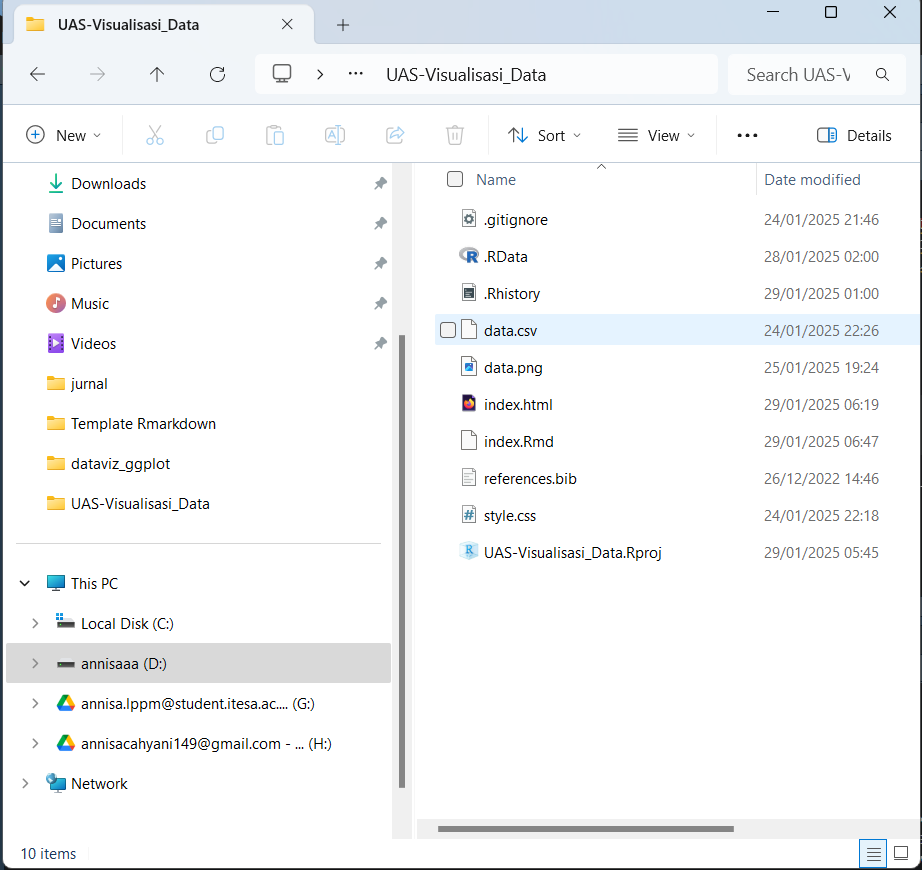

```{=html}
<style>
body{
text-align: justify}
</style>
```
```{r setup, include=FALSE}
knitr::opts_chunk$set(echo = TRUE)
```

# Pengantar 

Analisis data merupakan langkah penting dalam memahami berbagai tren sosial, ekonomi, dan demografi suatu negara. Dataset yang digunakan dalam penelitian ini berisi informasi tentang berbagai negara dari tahun ke tahun, mencakup variabel seperti angka harapan hidup, pendapatan per kapita, populasi, dan rata-rata jumlah anak.

Dengan menggunakan bahasa pemrograman R dan library ggplot2, analisis ini bertujuan untuk mengeksplorasi hubungan antara variabel-variabel tersebut. Melalui visualisasi data, kita dapat memahami bagaimana angka harapan hidup dan pendapatan per kapita berkembang seiring waktu di berbagai wilayah dunia. Selain itu, analisis ini juga dapat membantu dalam mengidentifikasi pola dan perbedaan antar negara dan benua.

Penelitian ini tidak hanya berfokus pada eksplorasi data, tetapi juga pada pemanfaatan teknik statistik untuk mendapatkan wawasan yang lebih mendalam. Dengan demikian, hasil dari analisis ini diharapkan dapat memberikan gambaran yang jelas mengenai tren global dalam berbagai aspek sosial-ekonomi.n ggplot2 sebagai pilihan utama untuk analisis data di R.


## Dasar-Dasar  
Langkah awal kita harus memasukan data csv ke R. 
untuk memudahkan, drag and drop di folder yang akan di gunakan



Kemudian di baca datanya 
```{r cars}
data <- read.csv("data.csv")
```


# Univat
Univariat adalah teknik eksplorasi data yang hanya melibatkan satu variabel untuk memahami distribusinya, kecenderungan sentral, dan penyebarannya. Pada histogram di bawah, visualisasi dilakukan dipangil menggunaan library(ggplot2) dengan menampilkan distribusi angka harapan hidup. Warna diatur agar lebih estetis, serta ditambahkan garis kepadatan (density) untuk memperjelas pola distribusi. Dengan menggunakan binwidth = 5, histogram menunjukkan bagaimana nilai angka harapan hidup tersebar dalam dataset, membantu dalam analisis tren dan identifikasi outlier.

```{r}
# Histogram angka_harapan_hidup
library(ggplot2)

ggplot(data, aes(x = Angka_Harapan_Hidup)) +
  geom_histogram(binwidth = 5, fill = "#E5989B", color = "#B5828C") +
  labs(title = "Distribusi Angka Harapan Hidup", x = "Angka Harapan Hidup", y = "Frekuensi") +
  theme_minimal()

```

# Bivariat

## scatter plot 
pendapatan_perkapita dan angka_harapan_hidup

```{r}
# Memuat library
library(ggplot2)

# Menghitung total populasi per benua
total_population <- aggregate(Populasi ~ Benua, data = data, sum)

# Visualisasi dengan sumbu dibalik
ggplot(total_population, aes(y = Benua, x = Populasi, fill = Benua)) +
  geom_bar(stat = "identity") +
  labs(title = "Total Populasi Berdasarkan Benua",
       x = "Total Populasi",
       y = "Benua") +
  theme_minimal() +
  scale_fill_brewer(palette = "Pastel1")


```

# Multivariat


```{r}
suppressPackageStartupMessages(library(plotly))


# Membuat 3D scatter plot
plot_ly(data, x = ~Pendapatan_per_kapita, y = ~Angka_Harapan_Hidup, z = ~Populasi, 
        type = "scatter3d", mode = "markers", color = ~Benua) %>%
  layout(title = "3D Scatter Plot: Pendapatan Per Kapita vs Angka Harapan Hidup vs Populasi",
         scene = list(xaxis = list(title = 'Pendapatan Per Kapita'),
                      yaxis = list(title = 'Angka Harapan Hidup'),
                      zaxis = list(title = 'Populasi')))
```


```{r}

```

# interaktif
 Scatter plot dengan animasi berdasarkan Tahun

```{r}
library(plotly)
options(warn = -1)

fig <- plot_ly(data, 
               x = ~Pendapatan_per_kapita, 
               y = ~Angka_Harapan_Hidup, 
               size = ~Populasi, 
               color = ~Benua, 
               frame = ~Tahun, 
               text = ~paste("Negara:", Negara, 
                             "<br>Pendapatan:", Pendapatan_per_kapita, 
                             "<br>Harapan Hidup:", Angka_Harapan_Hidup, 
                             "<br>Populasi:", Populasi),
               type = 'scatter', 
               mode = 'markers') %>% 
  layout(title = "Perubahan Multivariat dari Tahun ke Tahun",
         xaxis = list(title = "Pendapatan Per Kapita"),
         yaxis = list(title = "Angka Harapan Hidup"))

fig

# Mengembalikan opsi peringatan ke normal
options(warn = 0)


```


# Referensi

